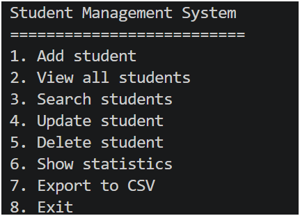
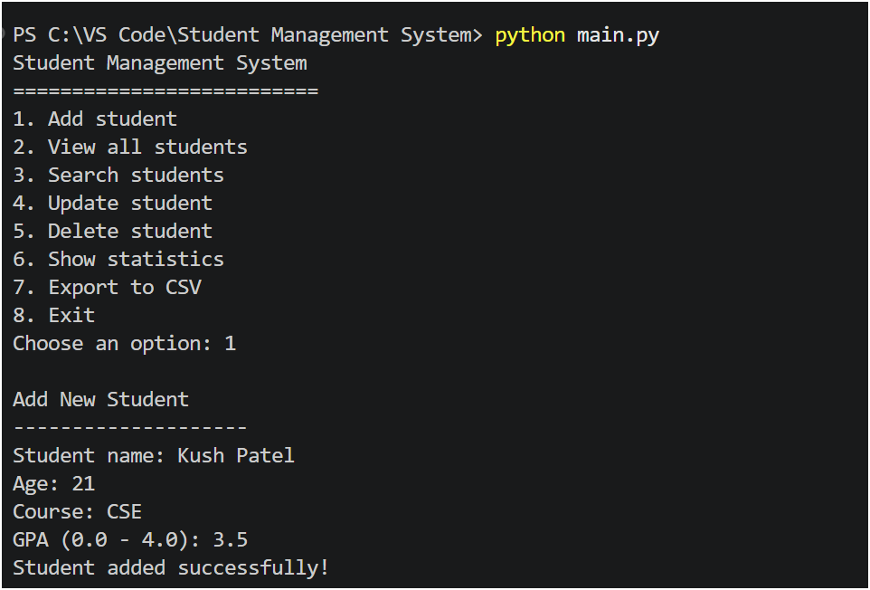
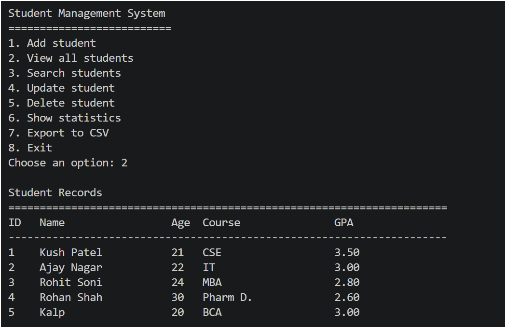
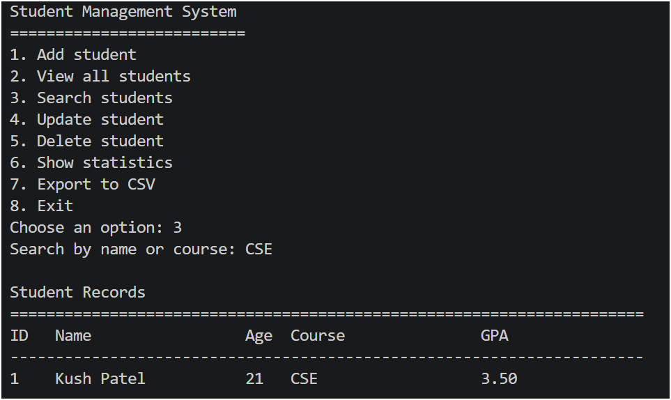
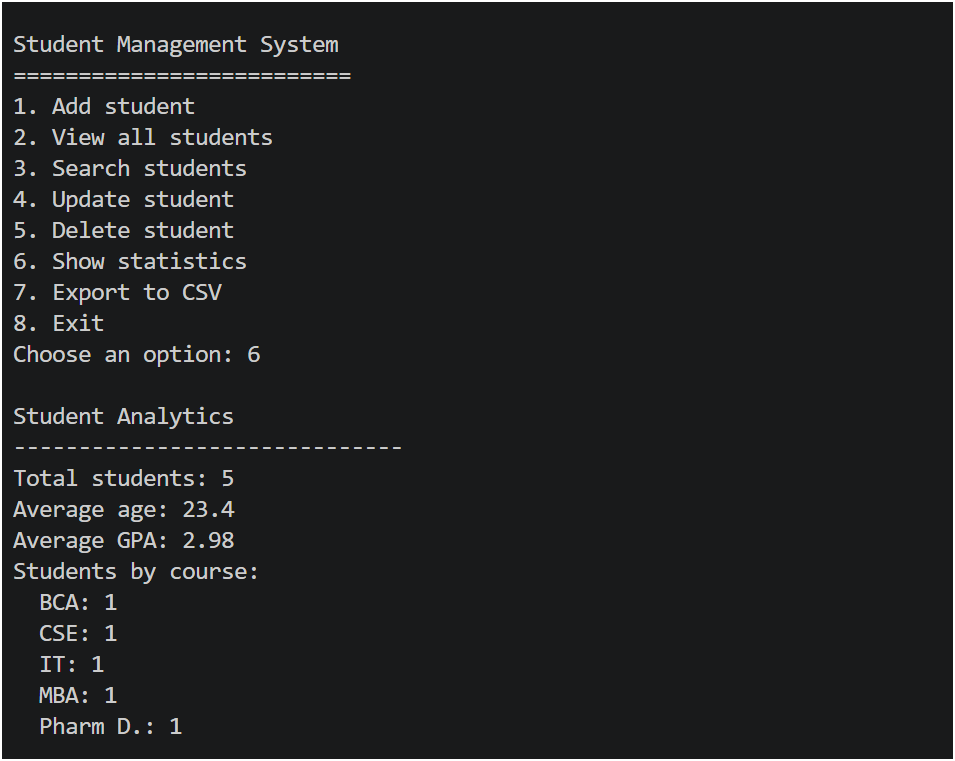
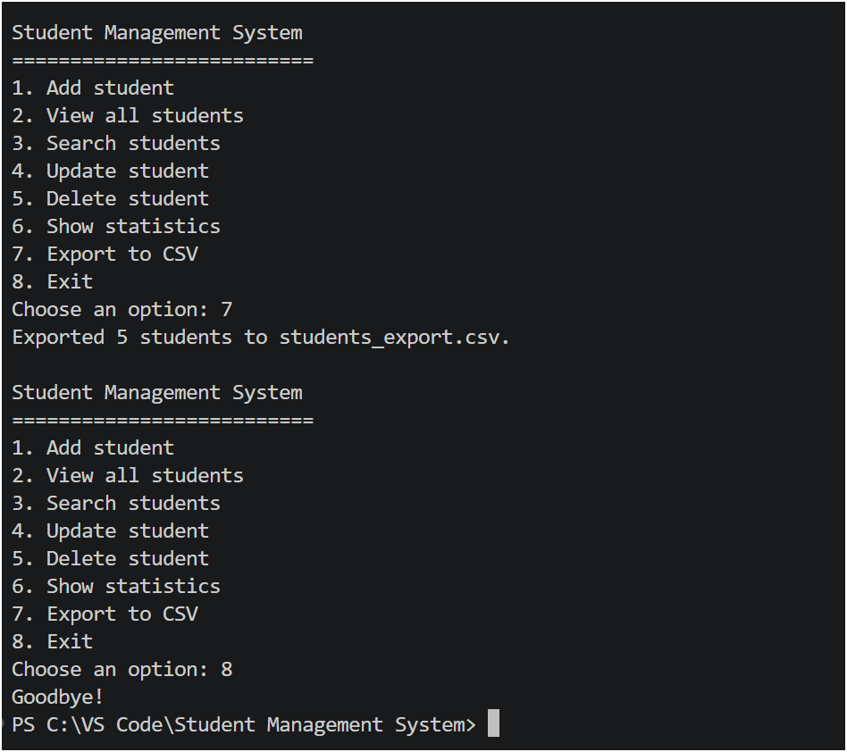

# 🎓 Student Management System (Python CLI)

A simple Python-based application to manage student records with features like search, analytics, and CSV export.

## 🚀 Features
- Add, update, delete students
- Search functionality
- JSON data storage
- Export to CSV
- Student statistics

## ▶️ How to run
python main.py

## 🛠️ Tech used
- Python
- JSON
- CSV

## 📷 Project Output

### Main Menu

### Add Student

### View Students

### Search Function

### Statistics

### Export to CSV 

